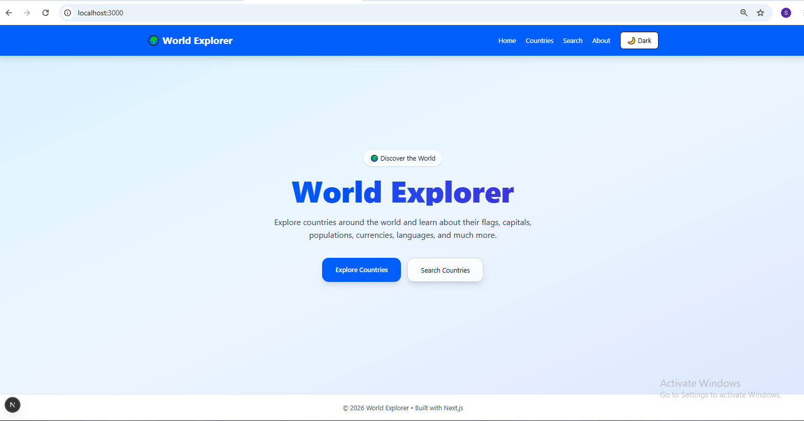
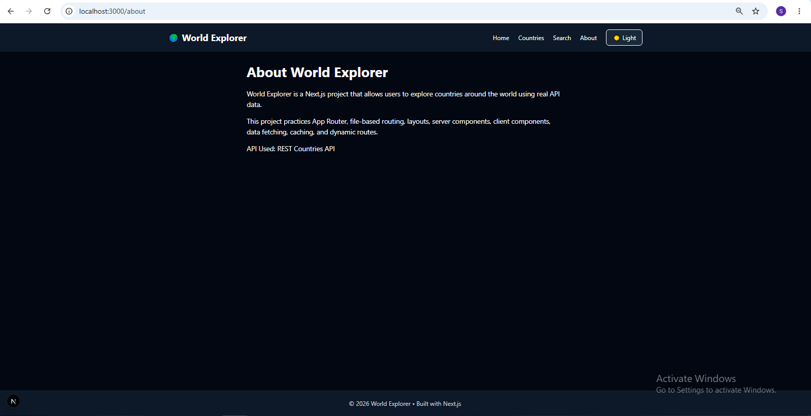
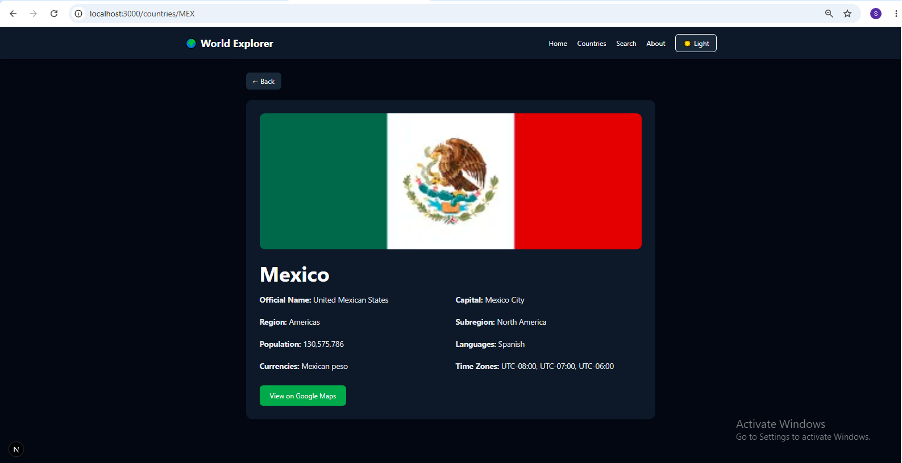
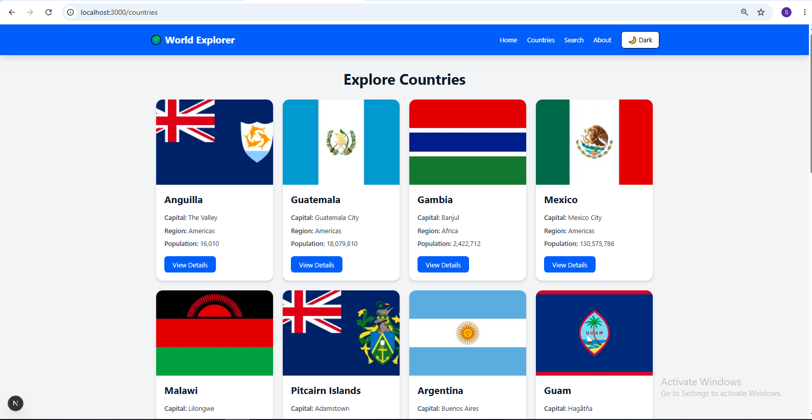
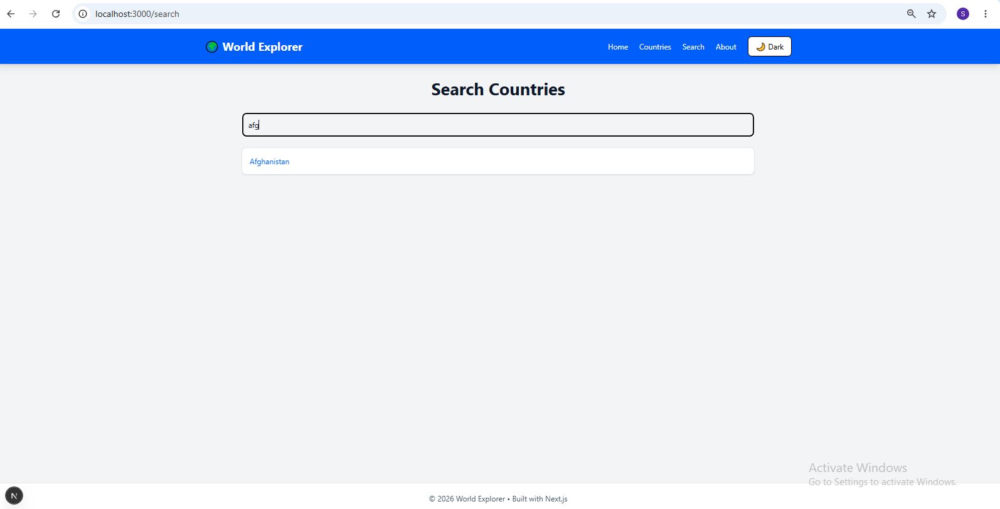
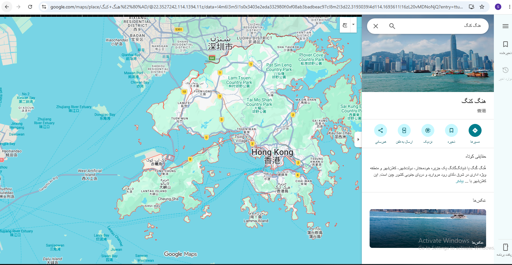

# Country Explorer
## Project Description
Country Explorer is a modern web application built with Next.js that allows users to explore countries around the world, search for countries, and view detailed information about each country using real-time data from the REST Countries API.

---

## Features
- Next.js App Router
- File-based Routing
- Shared Layout
- Dynamic Routes
- Server Components
- Client Components
- Real API Data Fetching
- Static Rendering & Caching
- Search Functionality
- Country Details Page
- Responsive Design
- Dark Mode Support
- Google Maps Integration

---

## Country Information
Users can view:

- Country Name
- Flag
- Capital
- Population
- Region
- Languages
- Currency
- Time Zones
- Google Maps Link

---

## Technologies Used
- Next.js
- React
- Tailwind CSS
- JavaScript
- REST Countries API

---

# API Used
REST Countries API

https://restcountries.com

---

## Screenshots

### Home


###  About page


### Details


### Countries



### Search by title/name 


### Map view


---

## Project Structure

```bash

 country-explorer/
 ├── app/
 ├── components/
 ├── public/
 ├── screenshots/
 ├── README.md/
```
---

## GitHub Repository

[View Repository](https://github.com/somaiamosadeq1212/country-explorer)

---

## Installation & Running

### Navigate into the project folder:

``` bash
cd product-store
```

### Install dependencies:

```bash
npm install
```

### Start the development server:

```bash
npm run dev
```

### Open the app in your browser:

```bash
http://localhost:3000
```

## Author
- Somaya Mosadiq
- React and Next.js Developer
